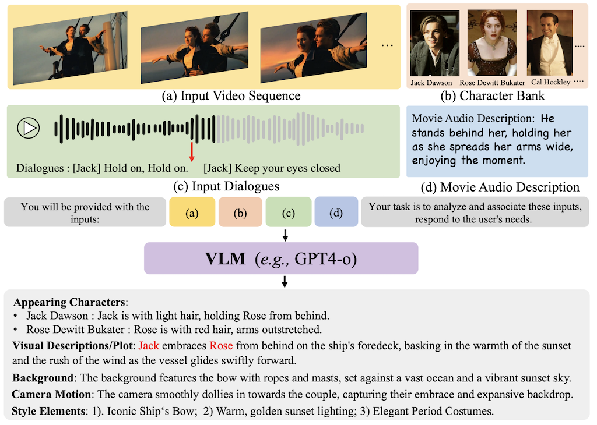

# MovieBench
### <div align="center"> A Hierarchical Movie Level Dataset for Long Video Generation <div> 

<div align="center">
  <a href="https://weijiawu.github.io/MovieBench/"></a> &ensp;
  <a href="https://arxiv.org/abs/2411.15262"></a> &ensp;
</div>

## :notes: **Updates**

- [x] Mar. 16, 2025. Release Metric Scripts.
- [x] Release Dataset with Character Bank and Shot-level Description.
- [x] Dec. 16, 2024. Release [DataSplit](https://github.com/showlab/MovieBench/blob/main/data/data_split.json), [Scene Split](https://github.com/showlab/MovieBench/blob/main/data/movies_scenes.json).
- [x] Dec. 16, 2024. Release the Scripts for Shot-Level Annotation Generation with GPT4.
- [x] Nov. 22, 2024. Rep initialization.


---
## :notes: **Todo**
- [ ] Building Leaderboard.


## 🐱 Abstract

**MovieBench** is a hierarchical dataset designed for advancing research in **long video generation**. It addresses the challenges associated with generating coherent, movie-length videos by providing a dataset that includes:  
1. **Rich, coherent storylines and multi-scene narratives**, capturing the essence of movie-level storytelling.  
2. **Consistency of character appearance and audio** across scenes, enabling character-focused generation.  
3. **Hierarchical data structure**, featuring both high-level movie information and detailed shot-level descriptions for fine-grained analysis.  

This dataset aims to inspire new research directions and tackle challenges such as maintaining **character ID consistency** across multiple scenes for various characters.

---


---


## Key Features  
- **Movie-Length Video Descriptions**: Comprehensive descriptions capturing scene transitions and narrative coherence.  
- **Character Bank**: Includes detailed information on character identities, roles, and visual/audio consistency across scenes.  
- **Shot-Level Details**: Fine-grained descriptions for each shot, including visual and narrative cues.  
- **Open Access and Continuous Updates**: The dataset is publicly available and will be regularly updated to include more diverse content and refined annotations.  


## ⏬ Download Data

### Video

This work is annotated and tested based on the LSMDC dataset. For details about the source movies, please refer to the [dataset documentation](https://sites.google.com/site/describingmovies/download?authuser=0).


Please make sure to request access to the [MPII Movie Description dataset (MPII-MD)](https://www.mpi-inf.mpg.de/departments/computer-vision-and-machine-learning/research/vision-and-language/mpii-movie-description-dataset/request-access-to-mpii-movie-description-dataset/) first and cc the approval email to sierkinhane@gmail.com. 

### Character Bank & Shot Level Description

The Annotation of MovieBench is available for download from the following locations:  

- **Hugging Face**: Access the dataset on Hugging Face's platform at:  
  [MovieBench on Hugging Face](https://huggingface.co/datasets/weijiawu/MovieBench/tree/main)  

- **Google Drive**: Alternatively, you can download the dataset from Google Drive:  
  [MovieBench on Google Drive](https://drive.google.com/drive/folders/11xyzDziLTLN5dNmzFwkiqy4LXB2oHXws?usp=drive_link)  

Both sources contain the full dataset, including character bank information, shot-level descriptions. Make sure to check the platform that best suits your needs. 

```
├── MovieBench/ 
|   ├── Annotation_Shot_Desc_11.15_V2_160movies
|   |   ├—— 0001_American_Beauty
|   |   ├—— 0002_As_Good_As_It_Gets
|   |   |   ├—— 0002_As_Good_As_It_Gets_00.00.43.459-00.00.43.636.json
|   |   |   ├—— ...
|   ├── Character_Bank_All_11.16
|   |   ├—— 0001_American_Beauty
|   |   ├—— 0002_As_Good_As_It_Gets
|   |   |   ├—— Helen_Hunt-Carol_Connelly
|   |   |   |   ├—— best.jpg
|   |   |   |   ├—— ...
|   ├── movies_scenes.json
|   ├── data_split.json
|   ├── mad2plot.json
```


## ⏬ Shot-Level Annotation Generation with GPT4

We developed our Shot-Level Annotation Generation system based on [MovieSeq](https://github.com/showlab/MovieSeq), leveraging GPT-4 to enhance its functionality.





Using a Visual Language Model (e.g., GPT-4), you can generate detailed annotations that include the following elements:
```
{
    "Characters":
    {
        "Character Name 1": "Description for appearance and behavior of Character 1, within 30 words",
        "Character Name 2": "Description for appearance and behavior of Character 2, within 30 words", 
    },
    "Style Elements":
    [
        "Element 1", "Element 2", "Element 3"
    ],
    "Plot":"A concise summary focusing on the main event or emotion, within 80 words",
    "Background Description":"A concise summary focusing on the main event or emotion, within 40 words",
    "Camera Motion":"A concise summary focusing camera motion, within 30 words."
}
```

For detailed ```environment setup``` and ```usage instructions```, please refer to the corresponding [README](https://github.com/showlab/MovieBench/tree/main/MovieBench).


## ⏬ Metric

The corresponding metric release is available [here]().


## 📖BibTeX
    @misc{wu2024moviebenchhierarchicalmovielevel,
      title={MovieBench: A Hierarchical Movie Level Dataset for Long Video Generation}, 
      author={Weijia Wu and Mingyu Liu and Zeyu Zhu and Xi Xia and Haoen Feng and Wen Wang and Kevin Qinghong Lin and Chunhua Shen and Mike Zheng Shou},
      year={2024},
      eprint={2411.15262},
      archivePrefix={arXiv},
      primaryClass={cs.CV},
      url={https://arxiv.org/abs/2411.15262}, 
      }
    
## 🤗Acknowledgements
- Thanks to [Diffusers](https://github.com/huggingface/diffusers) for the wonderful work.
